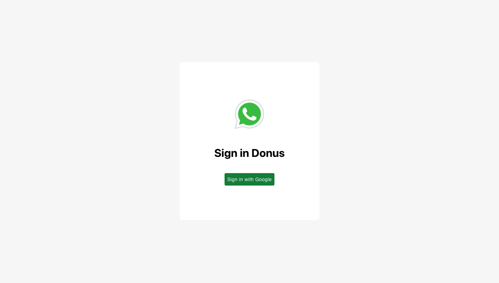
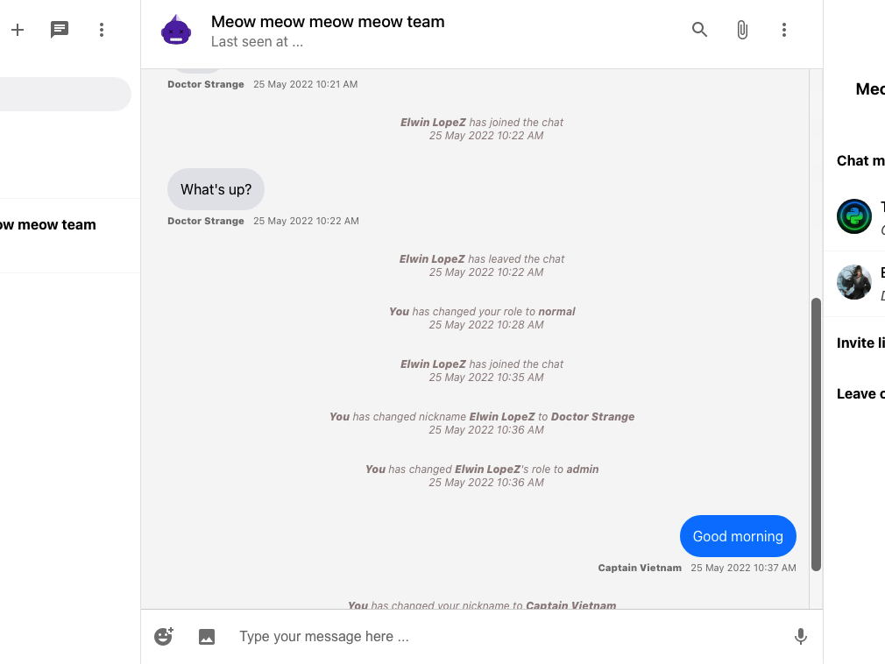
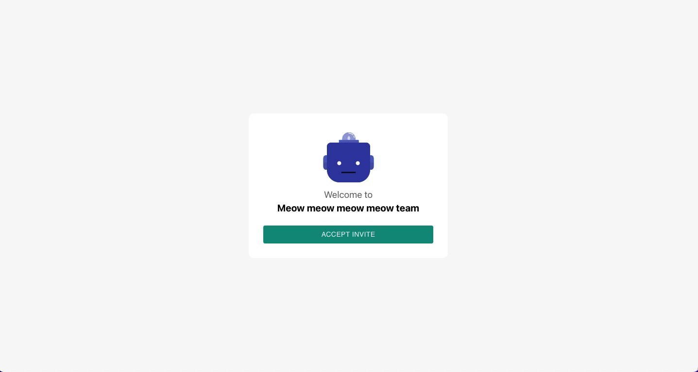
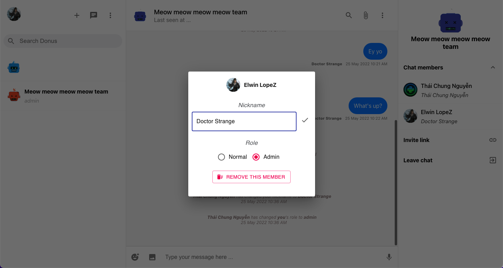

# Donus

<!--- These are examples. See https://shields.io for others or to customize this set of shields. You might want to include dependencies, project status and licence info here --->


<!--  -->

Donus is a free web-based messaging app for everyone. It is built using React, Redux and Firebase cloud storage. You can use it to make chat group with your friends, send and receive messages instantly, or do cool things with it. Feel free to discover and enjoy it!

## Live demo

You can use the Donus app here: https://donus-chat.web.app/




#### Chat



#### Invite new friends to the chat


#### Join a chat



#### Chat member settings



## Installing Donus

To install Donus, use this command:

```
npm install

or

yarn install
```
## Using Donus

To run Donus, use this command:

```
npm run start

or 

yarn start
```

## Contributing to Donus
<!--- If your README is long or you have some specific process or steps you want contributors to follow, consider creating a separate CONTRIBUTING.md file--->
To contribute to Donus, follow these steps:

1. Fork this repository.
2. Create a branch: `git checkout -b <branch_name>`.
3. Make your changes and commit them: `git commit -m '<commit_message>'`
4. Push to the original branch: `git push origin Donus/<location>`
5. Create the pull request.

Alternatively see the GitHub documentation on [creating a pull request](https://help.github.com/en/github/collaborating-with-issues-and-pull-requests/creating-a-pull-request).

<!-- ## Contributors

Thanks to the following people who have contributed to this project:

* [@scottydocs](https://github.com/scottydocs) 📖
* [@cainwatson](https://github.com/cainwatson) 🐛
* [@calchuchesta](https://github.com/calchuchesta) 🐛

You might want to consider using something like the [All Contributors](https://github.com/all-contributors/all-contributors) specification and its [emoji key](https://allcontributors.org/docs/en/emoji-key). -->

## Contact

If you want to contact me you can reach me at [Linkedin](https://www.linkedin.com/in/galin-chung-nguyen/).

### **Have a good day!**

<!-- ## License

This project uses the following license: [<license_name>](<link>). -->
<!-- # Donus

Donus is a free web-based messaging app for everyone. It's built using React, Redux and Firebase storage. You can use it to make chat group with your friends, send and receive messages instantly, do cool things with it. Feel free to discover and enjoy it!

#### Login screen


#### Chat


#### Invite new friends to the chat


#### Join a chat


#### Chat member settings


You can check it out here: https://donus-chat.web.app/

### **Have a good day!**
 -->
